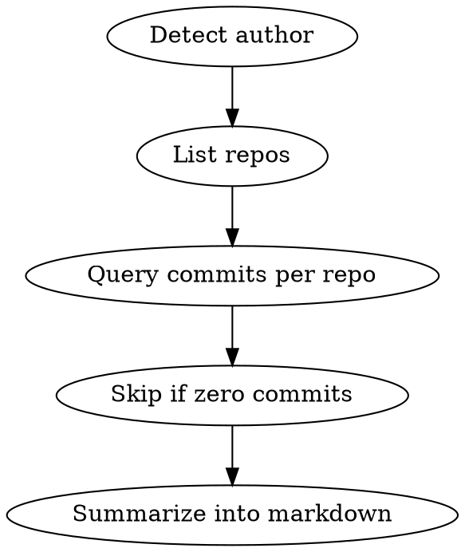

# ADO Scrum Update

Generate a scrum-ready progress report by querying recent commits across all repos in an Azure DevOps project, filtered by author and date range.

## Prerequisites

- `az login` completed
- `jq` available
- Env vars: `CC_ADO_ORG` (organization name), `CC_ADO_PROJECT` (project name)

## Workflow



1. **Detect author email** via `az account show --query user.name -o tsv`
2. **Read org/project** from `$CC_ADO_ORG` and `$CC_ADO_PROJECT`
3. **List all repos** via Repos API
4. **For each repo**, query commits on its default branch filtered by author and time range
5. **Skip repos** with zero commits
6. **Summarize** into scrum-ready markdown — concise descriptions, not raw commit messages

## Authentication

All API calls use `az rest` with `--resource 499b84ac-1321-427f-aa17-267ca6975798` (Azure DevOps app ID).

## API Reference

| API | Method | URL |
|-----|--------|-----|
| List Repos | GET | `https://dev.azure.com/{org}/{project}/_apis/git/repositories?api-version=7.0` |
| List Commits | GET | `https://dev.azure.com/{org}/{project}/_apis/git/repositories/{repoId}/commits?api-version=7.0` |

### Commits API query parameters

| Parameter | Description |
|-----------|-------------|
| `searchCriteria.fromDate` | ISO 8601 date (e.g., `2026-03-10T00:00:00Z`) |
| `searchCriteria.itemVersion.version` | Branch name (without `refs/heads/` prefix) |
| `searchCriteria.author` | Author email or display name |
| `searchCriteria.$top` | Max commits to return |

### Default branch

Each repo's `defaultBranch` field returns `refs/heads/main` format. Strip the `refs/heads/` prefix before using as `searchCriteria.itemVersion.version`.

## Complete Script

```bash
# 1. Detect author
AUTHOR=$(az account show --query user.name -o tsv)
ORG="${CC_ADO_ORG:?Set CC_ADO_ORG env var}"
PROJECT="${CC_ADO_PROJECT:?Set CC_ADO_PROJECT env var}"
DAYS_BACK="${1:-3}"
FROM_DATE=$(date -u -d "${DAYS_BACK} days ago" +%Y-%m-%dT00:00:00Z 2>/dev/null || date -u -v-${DAYS_BACK}d +%Y-%m-%dT00:00:00Z)

# 2. List all repos with default branches
repos=$(az rest --method GET \
  --url "https://dev.azure.com/${ORG}/${PROJECT}/_apis/git/repositories?api-version=7.0" \
  --resource "499b84ac-1321-427f-aa17-267ca6975798" 2>/dev/null | python3 -c "
import json, sys
data = json.load(sys.stdin)
for repo in data['value']:
    branch = repo.get('defaultBranch', 'refs/heads/main').replace('refs/heads/', '')
    print(f'{repo[\"id\"]}|{repo[\"name\"]}|{branch}')
")

# 3. Query commits per repo
echo "$repos" | while IFS='|' read -r repo_id repo_name branch; do
    result=$(az rest --method GET \
        --url "https://dev.azure.com/${ORG}/${PROJECT}/_apis/git/repositories/${repo_id}/commits?api-version=7.0&searchCriteria.fromDate=${FROM_DATE}&searchCriteria.itemVersion.version=${branch}&searchCriteria.author=${AUTHOR}&searchCriteria.\$top=50" \
        --resource "499b84ac-1321-427f-aa17-267ca6975798" 2>/dev/null)

    count=$(echo "$result" | python3 -c "import json,sys; d=json.load(sys.stdin); print(d.get('count',0))" 2>/dev/null)

    if [ "$count" != "0" ] && [ -n "$count" ]; then
        echo "=== $repo_name ($branch) - $count commits ==="
        echo "$result" | python3 -c "
import json, sys
data = json.load(sys.stdin)
for c in data.get('value', []):
    date = c['author']['date'][:10]
    msg = c['comment'].split('\n')[0][:120]
    print(f'  [{date}] {msg}')
" 2>/dev/null
        echo ""
    fi
done
```

## Output Format

After collecting commits, summarize into this format. Write **concise descriptions** of what changed — do not copy raw commit messages verbatim. Group related commits into single bullet points.

```markdown
## Scrum Update (date range)

**RepoName**
- concise description of change or feature
- another change

**RepoName2**
- concise description
```

## Common Mistakes

| Mistake | Prevention |
|---------|-----------|
| Using `az rest` without `--resource` flag | Always pass `--resource 499b84ac-1321-427f-aa17-267ca6975798` |
| Passing `refs/heads/main` as branch in query param | Strip `refs/heads/` prefix — use just `main` |
| Copying raw commit messages into the report | Summarize and group related commits into concise descriptions |
| Forgetting `searchCriteria.$top` | Without it, API may return limited results; set to 50+ |
| Hardcoding author email | Auto-detect via `az account show` so skill works for any user |
| Using `ADO_ORG` instead of `CC_ADO_ORG` | Both ADO skills use `CC_ADO_ORG` and `CC_ADO_PROJECT` — do not use the unprefixed variants |
