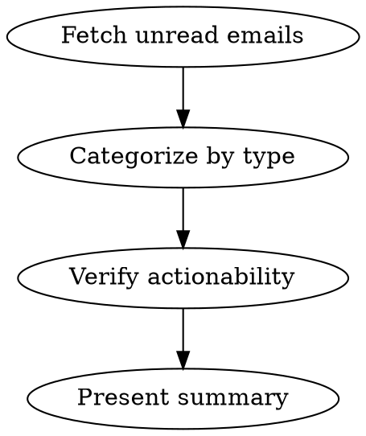

# Daily Mail

Review and triage unread emails, categorizing them by urgency and verifying actionability through external systems (ADO pipelines, S360, etc.).

## Workflow



### Step 1: Fetch Unread Emails

Use the Mail MCP to fetch recent unread emails:

```
SearchMessagesQueryParameters:
  queryParameters: "?$filter=isRead eq false&$top=30&$orderby=receivedDateTime desc&$select=id,subject,from,receivedDateTime,bodyPreview,importance,hasAttachments"
```

### Step 2: Categorize by Type

Classify each email into one of these categories:

| Category | Examples | Default Action |
|----------|----------|----------------|
| **Needs Action** | Manual validation pending, approval requests, assigned tasks | Verify then present |
| **Alerts** | Azure Monitor alerts, build failures, Sev incidents | Verify current status |
| **Reports** | S360 daily report, digest emails | Cross-check with source system |
| **Informational** | Build succeeded, resolved incidents, newsletters | Summarize briefly |
| **Noise** | Marketing, Medium articles, auto-digests | Skip unless user asks |

### Step 3: Verify Actionability

For each "Needs Action" or "Alert" email, verify against the source system before presenting:

#### ADO Pipeline Notifications

For build failure or manual validation emails:

1. Extract the build ID and pipeline name from the email body (read full email via `GetMessage` if needed)
2. Check the build status:
   ```
   az pipelines build show --id <buildId> --org <org> --project <project> --query "{status: status, result: result, finishTime: finishTime, definitionName: definition.name}" -o json
   ```
3. If the build already completed successfully → mark as "can ignore". **This includes manual validation pending emails** — if the overall build/release run has status=completed and result=succeeded, it means the validation stage was already approved or bypassed. Do NOT tell the user they still need to approve it.
4. For build failures, check if a subsequent run on the same branch succeeded:
   ```
   az pipelines build list --org <org> --project <project> --top 5 --query "[?definition.name=='<pipeline>'].{id:id, buildNumber:buildNumber, status:status, result:result, finishTime:finishTime, sourceBranch:sourceBranch}" -o json
   ```
5. If a later run succeeded on the same branch → mark as "can ignore"

#### S360 Daily Report

1. Query active action items for the service using S360 MCP:
   ```
   search_active_s360_kpi_action_items:
     request: { targetIds: ["<service-id>"], pageSize: 50 }
   ```
   **Important:** Query by service targetId, NOT by assignedTo alias (check memory for the correct service ID).
2. If no active items → mark as "can ignore"
3. If items exist → list them with KPI name, due date, and status

#### Azure Monitor Alerts

1. Read the full email to get alert details (severity, resource, timestamp)
2. Check if a "RESOLVED" email exists in the same conversation
3. For **probe failure** alerts (e.g., "LB Probe Failure"):
   a. Extract the scheduled query rule resource ID from the email HTML (look for `microsoft.insights/scheduledqueryrules/` in subscription paths)
   b. Get the alert rule details to find the underlying KQL query:
      ```
      az monitor scheduled-query show --name <rule-name> --resource-group <rg> --subscription <sub> --query "{query: criteria.allOf[0].query}" -o json
      ```
   c. Run the query against the Log Analytics workspace to check recent probe status:
      ```
      az monitor log-analytics query --workspace <workspace-id> --analytics-query "<KQL query modified to show recent results with status>" -o table
      ```
   d. If recent probe runs all show `pass` → mark as "can ignore" (self-recovered)
4. For other alerts, present current status

#### Insurance / Financial Notifications

1. Read full email to determine if it's a pure notification or requires action
2. System-generated "do not reply" emails with completed transactions → mark as "can ignore"

#### Grok AI Daily Digest

**IMPORTANT: Always execute these steps for Grok emails. Do NOT just summarize the email body — it is always truncated.**

1. Read the full email HTML via `GetMessage` with `preferHtml: true`
2. Extract the Grok chat URL from the HTML (search for `grok.com/chat/` in link hrefs, use the `originalsrc` attribute, not the safelinks wrapper)
3. Open the URL using Chrome MCP (`new_page`)
4. If login is required, use Google login flow (click "使用 Google 登录", select account)
5. Take a snapshot (`take_snapshot`) and extract the full content
6. Summarize the key points and present in **Worth Noting**

#### Meeting Invites / Learning Events

1. For calendar invites (`eventMessageRequest` type) and activity/learning invitations, do NOT deep-verify
2. Present a brief one-line summary table with: sender, topic description
3. Format as: `| Subject | Sender | Brief description |`

### Step 4: Present Summary

Output a structured summary table:

```markdown
### Needs Action
1. **[Subject]** — [what needs to be done]

### Worth Noting
1. **[Subject]** — [brief summary]

### Can Ignore (verified)
| Email | Reason |
|-------|--------|
| [Subject] | [why — with verification result, e.g. "probe recovered, last 10 runs all pass"] |

### Ignored by Rule
| Email | Rule |
|-------|------|
| [Subject] | [which rule matched, e.g. "Medium article", "build succeeded notification", "Microsoft Daily Digest"] |

### Meeting Invites / Learning Events
| Subject | Sender | Description |
|---------|--------|-------------|
| [Subject] | [Sender name] | [One-line summary of the event/meeting] |
```

**Distinction:**
- **Can Ignore (verified)**: Emails that *could* have needed action, but were verified against the source system and confirmed safe to skip (e.g., build failure with subsequent success, probe alert that self-recovered, S360 report with zero items)
- **Ignored by Rule**: Emails that are categorically noise and don't need verification (e.g., Medium articles, Microsoft Daily Digest, build succeeded notifications, marketing emails, newsletters)

## Notes

- Always read the full email (`GetMessage`) before making triage decisions — `bodyPreview` is often truncated
- For ADO pipeline emails, the org/project info can be extracted from URLs in the email body
- Grok daily digest emails may contain truncated content in the email body; always open the linked Grok chat for full content
- When multiple emails are about the same incident (e.g., AWARENESS → RESOLVED), group them together
- Present the summary in the user's language (Chinese if the conversation is in Chinese)
